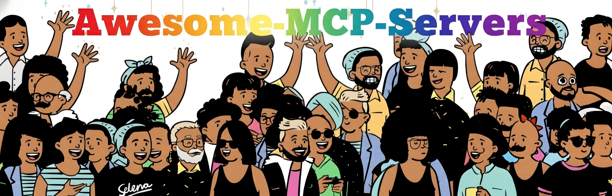

# Awesome MCP Server 

Eine kuratierte, community-getriebene Liste großartiger Model Context Protocol (MCP) Server, Tools, Frameworks, Clients und Dienstprogramme. MCP ist ein offenes Protokoll, das KI-Modellen die sichere Interaktion mit lokalen und Remote-Ressourcen über standardisierte Serverimplementierungen ermöglicht.

---

Hinweis: Wir stellen eine [vollständige Liste der MCP-Server](https://github.com/YuzeHao2023/Awesome-MCP-Servers/blob/main/Full-List-of-MCP-Servers.xlsx) bereit, die von einem Webcrawler zusammengestellt wurde und etwa 6000 Einträge enthält.

---

## Alle Dokumente
> Übersetzer gesucht! Hilf uns bei der [Übersetzer-Anfrage](https://github.com/YuzeHao2023/Awesome-MCP-Servers/issues/1).

**Lesen Sie unsere Dokumentation in den folgenden Sprachen:**

| Sprache | Link                                                                 |
|---------|---------------------------------------------------------------------|
| English  | [English](https://github.com/YuzeHao2023/Awesome-MCP-Servers?tab=readme-ov-file) |
| 简体中文  | [简体中文](https://github.com/YuzeHao2023/Awesome-MCP-Servers/blob/main/README_zh_CN.md) |
| 繁體中文  | [繁體中文](https://github.com/YuzeHao2023/Awesome-MCP-Servers/blob/main/README_zh_TW.md) |
| 日本語    | [日本語](https://github.com/YuzeHao2023/Awesome-MCP-Servers/blob/main/README_ja.md) |
| 한국어    | [한국어](https://github.com/YuzeHao2023/Awesome-MCP-Servers/blob/main/README_ko.md) |
| Deutsch   | [Deutsch](https://github.com/YuzeHao2023/Awesome-MCP-Servers/blob/main/README_de.md) |

---

## Was ist MCP?

[MCP](https://modelcontextprotocol.io/) (Model Context Protocol) ist ein offenes Protokoll, das KI-Modellen die sichere Interaktion mit lokalen und Remote-Ressourcen über standardisierte Serverimplementierungen ermöglicht. Diese Liste konzentriert sich auf produktionsreife und experimentelle MCP-Server, die KI-Fähigkeiten durch Dateizugriff, Datenbankverbindungen, API-Integrationen und andere Kontextdienste erweitern.

---

## Tutorials

* [Model Context Protocol (MCP) Quickstart](https://glama.ai/blog/2024-11-25-model-context-protocol-quickstart)
* [Claude Desktop App mit SQLite-Datenbank einrichten](https://youtu.be/wxCCzo9dGj0)

## Community

* [r/mcp Reddit](https://www.reddit.com/r/mcp)
* [Discord Server](https://glama.ai/mcp/discord)

---

## ⚠️ Sicherheitswarnung

Das Ausführen von MCP-Servern ohne ordnungsgemäße Sandbox-Umgebung kann zur Ausführung beliebigen Codes auf Ihrem System mit denselben Berechtigungen wie der Hostprozess führen, was erhebliche Sicherheitsrisiken darstellt.

Sicherheitsrisiken:
- Systemzugriff: Vollständiger Zugriff auf Dateien, Netzwerk und Systemressourcen
- Codeausführung: Kann beliebige Befehle auf Ihrem Rechner ausführen
- Prompt-Injektion: Böswillige Prompts könnten unbeabsichtigte Serveraktionen auslösen
- Datenleck: Sensible Daten können abgerufen oder weitergegeben werden

Empfohlene Best Practices:
- Offizielle Implementierungen (⭐) bevorzugen
- Server in VMs oder isolierten Containern ausführen
- Code und Konfiguration vor der Installation prüfen
- Prinzip der minimalen Rechtevergabe anwenden
- Serveraktivität und Protokolle überwachen

---

## Unterstützte Clients (Beispiele)

Viele MCP-Clients und -UIs können sich mit den Servern dieser Liste verbinden. Beispiele (nicht abschließend):
- Claude Desktop / Claude-Clients
- Zed
- Sourcegraph Cody
- Cursor
- Visual Studio Code
- LibreChat
- Verschiedene CLI- und browserbasierte Clients

---

## Server-Implementierungen (Kategorien)

- 📂 Dateisystem
- 📦 Sandbox & Virtualisierung
- 🔄 Versionskontrolle
- ☁️ Cloud-Speicher
- 🗄️ Datenbanken
- 💬 Kommunikation
- 📈 Monitoring
- 🔍 Suche & Web
- 🗺️ Standortdienste
- 🎯 Marketing
- 📝 Notizen
- ⚡ Cloud-Plattformen
- ⚙️ Workflow-Automatisierung
- 🤖 Systemautomatisierung
- 📱 Soziale Medien
- 🎮 Spiele
- 💹 Finanzen
- 🧬 Forschung & Daten
- 🤝 KI-Dienste
- 💻 Entwicklungstools
- 📊 Datenvisualisierung
- 🆔 Identität
- 🔗 Aggregatoren
- 💬 Sprache & Übersetzung
- 🔒 Sicherheit
- 🔌 IoT
- 🧑‍🎨 Kunst & Literatur
- 🛒 E-Commerce
- 📦 Datenplattformen
- 🤖 Robotik & Physische KI

Legende:
- ⭐ Offizielle Protokollimplementierung

---

# Referenz-Server

Die folgenden Server und SDK-Beispiele demonstrieren MCP-Funktionen:

- Everything (Referenz-/Testserver mit Prompts, Ressourcen und Tools)
  - https://github.com/modelcontextprotocol/servers/blob/main/src/everything
- Fetch
  - https://github.com/modelcontextprotocol/servers/tree/main/src/fetch
- Filesystem
  - https://github.com/modelcontextprotocol/servers/tree/main/src/filesystem
- Git
  - https://github.com/modelcontextprotocol/servers/tree/main/src/git
- Memory
  - https://github.com/modelcontextprotocol/servers/tree/main/src/memory
- Sequential Thinking
  - https://github.com/modelcontextprotocol/servers/tree/main/src/sequentialthinking
- Time
  - https://github.com/modelcontextprotocol/servers/blob/main/src/time

---

# Offizielle Server

Offizielle Integrationen werden von Unternehmen gepflegt, die produktionsreife MCP-Server für ihre Plattformen erstellen. (⭐ wenn markiert)

- 1mcpserver — https://github.com/particlefuture/1mcpserver
- 21st.dev Magic — https://github.com/21st-dev/magic-mcp
- 4everland/4everland-hosting-mcp — https://github.com/4everland/4everland-hosting-mcp
- Adfin — https://github.com/Adfin-Engineering/mcp-server-adfin
- AgentQL — https://github.com/tinyfish-io/agentql-mcp
- AgentRPC — https://github.com/agentrpc/agentrpc
- Aiven — https://github.com/Aiven-Open/mcp-aiven
- AlibabaCloud DevOps MCP — https://github.com/aliyun/alibabacloud-devops-mcp-server
- Apify Actors — https://github.com/apify/actors-mcp-server
- Box — https://github.com/box-community/mcp-server-box (⭐)
- Cloudflare — https://github.com/cloudflare/mcp-server-cloudflare (⭐)
- GitHub — https://github.com/github/github-mcp-server (offiziell)
- Notion — https://github.com/makenotion/notion-mcp (offiziell)
- Stripe — https://github.com/stripe/agent-toolkit/tree/main (⭐)
- PayPal — https://github.com/paypal/agent-toolkit/tree/main (⭐)
- Tinybird — https://github.com/tinybirdco/mcp-tinybird (⭐)

---

# Tools & Dienstprogramme

Dienstprogramme zum Suchen, Installieren, Verwalten und Arbeiten mit MCP-Servern:

- mcp-get — CLI zur Installation/Verwaltung von MCP-Servern für Claude Desktop — https://github.com/michaellatman/mcp-get
- Remote MCP — Remote-MCP-Kommunikationslösung — https://github.com/ssut/Remote-MCP
- yamcp — Model Context Workspace Manager — https://github.com/hamidra/yamcp
- ToolHive — Leichtgewichtiges Dienstprogramm zur vereinfachten Bereitstellung — https://github.com/StacklokLabs/toolhive
- MCP Installer — https://github.com/anaisbetts/mcp-installer

---

## Kategorie: Dateisystem (📂)

- Backup — https://github.com/hexitex/MCP-Backup-Server
- FileStash — https://github.com/mickael-kerjean/filestash/tree/master/server/plugin/plg_handler_mcp
- FileSystem (modelcontextprotocol Referenz) — https://github.com/modelcontextprotocol/servers/tree/main/src/filesystem
- FileSystem (mark3labs) — https://github.com/mark3labs/mcp-filesystem-server
- Everything Search — https://github.com/mamertofabian/mcp-everything-search
- llm-context — https://github.com/cyberchitta/llm-context.py

---

## Kategorie: Sandbox & Virtualisierung (📦)

- Microsandbox (⭐) — https://github.com/microsandbox/microsandbox
- E2B (⭐) — https://github.com/e2b-dev/mcp-server
- Docker (QuantGeekDev) — https://github.com/QuantGeekDev/docker-mcp

---

## Kategorie: Versionskontrolle (🔄)

- GitHub (offiziell) — https://github.com/github/github-mcp-server
- GitHub Repos Manager — https://github.com/kurdin/github-repos-manager-mcp
- GitLab — https://github.com/modelcontextprotocol/servers/tree/main/src/gitlab
- Git (direkt) — https://github.com/modelcontextprotocol/servers/tree/main/src/git
- Phabricator — https://github.com/baba786/phabricator-mcp-server
- Gitingest-MCP — https://github.com/puravparab/Gitingest-MCP

---

## Kategorie: Cloud-Speicher (☁️)

- Google Drive — https://github.com/modelcontextprotocol/servers/tree/main/src/gdrive
- Box (⭐) — https://developer.box.com/guides/box-mcp/
- VideoDB (agent-toolkit, ⭐) — https://github.com/video-db/agent-toolkit/tree/main/modelcontextprotocol
- Microsoft 365 — https://github.com/softeria/ms-365-mcp-server

---

## Kategorie: Datenbanken (🗄️)

- PostgreSQL — https://github.com/modelcontextprotocol/servers/tree/main/src/postgres
- SQLite — https://github.com/modelcontextprotocol/servers/tree/main/src/sqlite
- DuckDB — https://github.com/ktanaka101/mcp-server-duckdb
- Excel — https://github.com/haris-musa/excel-mcp-server
- BigQuery — https://github.com/LucasHild/mcp-server-bigquery
- Neon (⭐) — https://github.com/neondatabase/mcp-server-neon
- Qdrant (⭐) — https://github.com/qdrant/mcp-server-qdrant/
- MongoDB — https://github.com/kiliczsh/mcp-mongo-server
- MySQL — https://github.com/designcomputer/mysql_mcp_server
- Airtable — https://github.com/domdomegg/airtable-mcp-server
- Snowflake — https://github.com/isaacwasserman/mcp-snowflake-server

---

## Kategorie: Kommunikation (💬)

- Slack — https://github.com/korotovsky/slack-mcp-server
- LINE Official Account (⭐) — https://github.com/line/line-bot-mcp-server
- Linear — https://github.com/jerhadf/linear-mcp-server
- Atlassian — https://github.com/sooperset/mcp-atlassian
- Carbon Voice (⭐) — https://github.com/PhononX/cv-mcp-server

---

## Kategorie: Monitoring (📈)

- Metoro — https://github.com/metoro-io/metoro-mcp-server
- Raygun — https://github.com/MindscapeHQ/mcp-server-raygun
- Sentry — https://github.com/modelcontextprotocol/servers/tree/main/src/sentry

---

## Kategorie: Suche & Web (🔍)

- Puppeteer — https://github.com/modelcontextprotocol/servers/tree/main/src/puppeteer
- Brave Search — https://github.com/modelcontextprotocol/servers/tree/main/src/brave-search
- Bright Data — https://github.com/luminati-io/brightdata-mcp
- Scrapeless — https://github.com/scrapeless-ai/scrapeless-mcp-server

---

## Kategorie: Standortdienste (🗺️)

- Google Maps — https://github.com/modelcontextprotocol/servers/tree/main/src/google-maps

---

## Kategorie: Marketing (🎯)

- Agent Mindshare — https://agentmindshare.com

---

## Kategorie: Notizen (📝)

- Notion — https://github.com/danhilse/notion_mcp

---

## Kategorie: Cloud-Plattformen (⚡)

- Cloudflare (⭐) — https://github.com/cloudflare/mcp-server-cloudflare

---

## Kategorie: Workflow-Automatisierung (⚙️)

- Make (⭐) — https://github.com/integromat/make-mcp-server
- Zapier — https://zapier.com/mcp

---

## Kategorie: Systemautomatisierung (🤖)

- Shell (wcgw) — https://github.com/rusiaaman/wcgw

---

## Kategorie: Soziale Medien (📱)

- YouTube — https://github.com/anaisbetts/mcp-youtube

---

## Kategorie: Spiele (🎮)

- Unity-Implementierungen

---

## Kategorie: Finanzen (💹)

Zahlungen, Marktdaten und Finanztools.

- PayPal (⭐) — https://github.com/paypal/agent-toolkit
- Stripe (⭐) — https://github.com/stripe/agent-toolkit
- LongPort OpenAPI (⭐) — https://github.com/longportapp/openapi/tree/main/mcp
- x402engine-mcp (50+ kostenpflichtige APIs für KI-Agenten via HTTP 402-Mikrozahlungen) — https://github.com/agentc22/x402engine-mcp
- TWZRD Agent Intel (Solana-nativer x402 MCP für KI-Agenten-Vertrauensbewertung — Vertrauensbewertung und x402-Mikrozahlungsverifizierung für KI-Agenten auf Solana) — https://intel.twzrd.xyz

---

## Kategorie: Forschung & Daten (🧬)

- ArXiv — https://github.com/blazickjp/arxiv-mcp-server

---

## Kategorie: KI-Dienste (🤝)

- OpenAI — https://github.com/pierrebrunelle/mcp-server-openai

---

## Kategorie: Entwicklungstools (💻)

- Currents (⭐) — https://github.com/currents-dev/currents-mcp

---

## Kategorie: Datenvisualisierung (📊)

- VegaLite — https://github.com/isaacwasserman/mcp-vegalite-server

---

## Kategorie: Identität (🆔)

- Keycloak — https://github.com/ChristophEnglisch/keycloak-model-context-protocol

---

## Kategorie: Aggregatoren (🔗)

- MCPJungle — https://github.com/mcpjungle/MCPJungle

---

## Kategorie: Sprache & Übersetzung (💬)

- Lara (⭐) — https://github.com/translated/lara-mcp

---

## Kategorie: Sicherheit (🔒)

- Semgrep — https://github.com/semgrep/mcp

---

## Kategorie: IoT (🔌)

- Coreflux MQTT — https://github.com/CorefluxCommunity/CorefluxMCPServer

---

## Community-Server

Eine umfangreiche Liste von community-gepflegten Servern ist im Hauptdokument enthalten. Die vollständige Liste finden Sie in der Dokumentation.

---

# Hinweise

- Nicht vertrauenswürdige Community-Server in einer isolierten Umgebung wie einem Container oder einer VM ausführen.
- In Produktionsumgebungen offizielle (⭐) Implementierungen bevorzugen.
- Im Repository jedes Servers Transportmethode (stdio, SSE, HTTP), Authentifizierung und Beispiel-Clients prüfen.
